# AIAgent
基于Langgraph实现的智能体开发平台系统，包含单智能体(React/PlanExecute)，多智能体和工作流编排调试运行。

# 一：功能介绍
平台系统对标Dify\Coze等热门的智能体开发平台，系统实现了智能体的调试、发布和运行的功能，所有的懂呢个模块相互耦合，基于智能体运行的RunTime进行实时的流式和非流式的问答。

## 1.智能体编排
实现了单智能体、多智能体以及工作流的编排模式，支持会话流式输出和非流式输出。同时支持React运行模式、PlanExecute任务规划模式、Function_call运行模式。

## 2.模型接入
可对接标准的商用模型，如DeepSeek\OpenAI\Qwen\Ollama等常用的大模型服务，支持参数化配置大模型，如TopP\TopK\MaxTokens\Temperature等，会话时也可动态修改相关参数。

## 3.插件配置
支持HTTP/SQL的业务化接口的对接，配置运行时的参数，配置入参、出参以及测试连接，将业务接口按照标准的JSONSchema格式发布，便于大模型接入使用。

## 4.RAG知识库配置
支持常用的.pdf/.docx/.pptx/.xlsx/.txt/.html/.md等格式文档的上传、切分以及知识召回的功能。

## 5.FAQ问答对配置
支持创建业务集合，在集合下面创建问答对，进行问题相似度的回答，Score评分。

## 6.数据库配置
目前支持Mysql等主流数据库的接入，sql配置执行。

## 7.MCP配置
可接入标准上线的MCPServer的服务，支持SSE\Streamable_Http协议的传输方式，支持查看Server下面的工具列表和工具调用。

## 8.应用商店配置
发布后的智能体和工具可发布到应用商店，用户可以复制到自己的团队空间使用。

## 9.团队协作
基于工作空间进行的用户隔离、业务数据隔离，用户可以邀请其他成员加入团队空间，进行智能体的编排调试使用。

# 二：技术架构
前端：基于Vue3+TypeScripts的通用框架
后端：采用Python3.12+FastAPI+Qdrant+Mysql+Postgres的基础服务框架
核心Runtime基于Langgraph的底层框架封装的智能体Graph运行接口

部署运维：采用Docker部署方式，镜像基于Jenkins一键打包发布

系统架构
# 三：功能详情截图
## 1.智能体编排
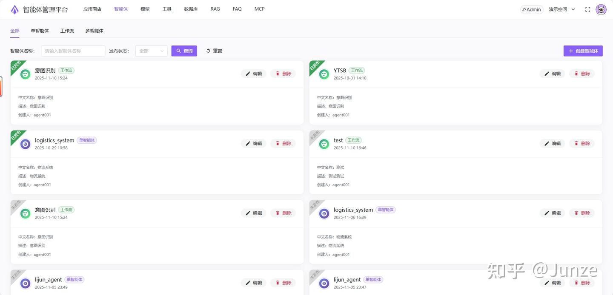
智能体列表
单智能体
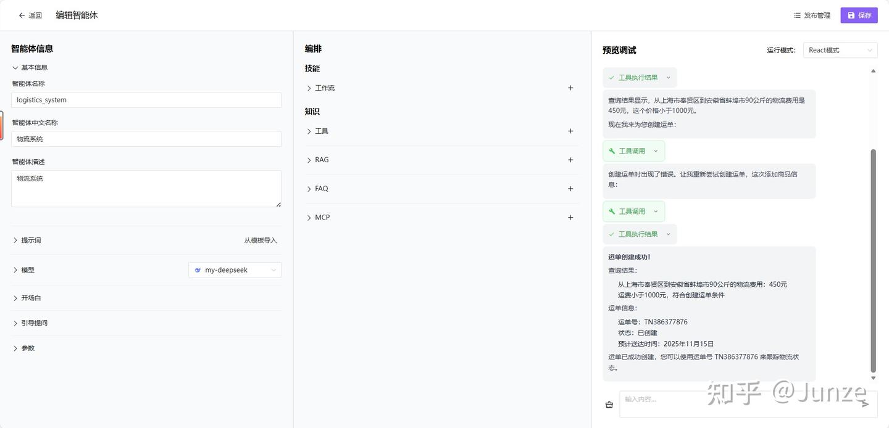
单智能体(React运行模式)
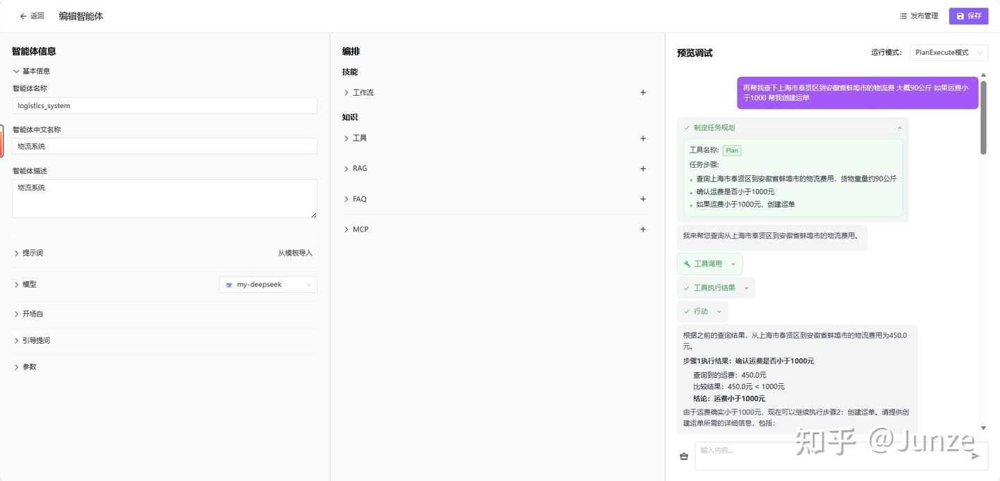
单智能体(PlanExecute模式)

工作流
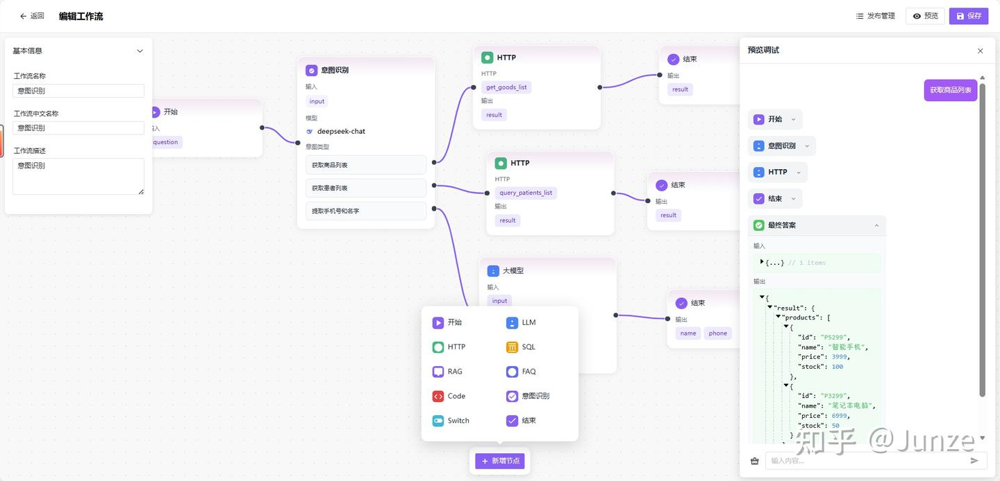
工作流编排调试
多智能体
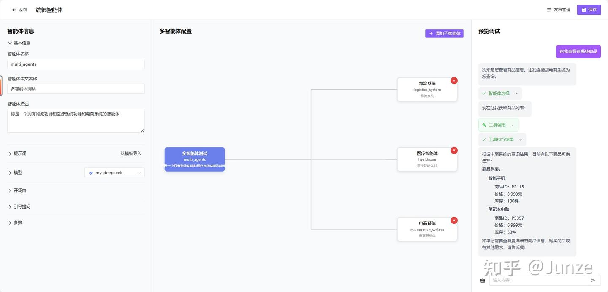
多智能体编排调试
## 2.模型接入
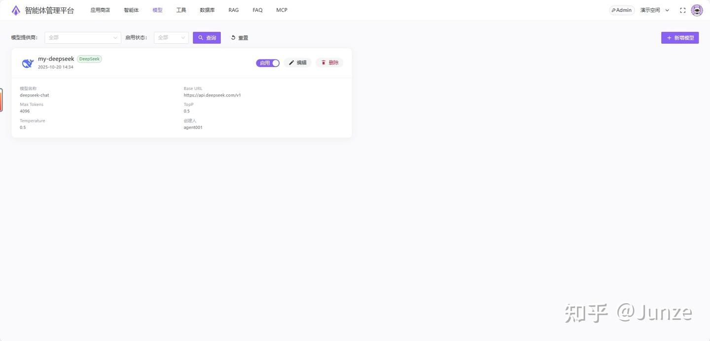
模型列表
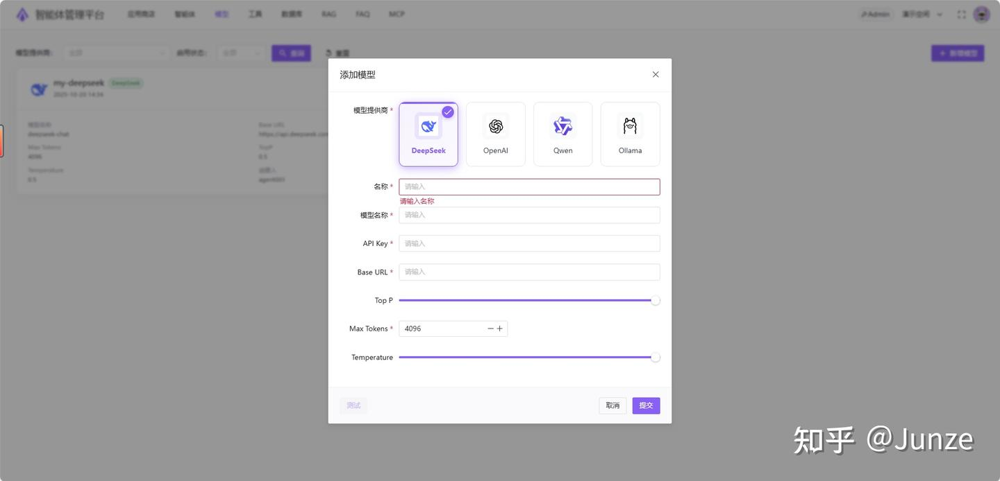
新建模型
## 3.插件配置
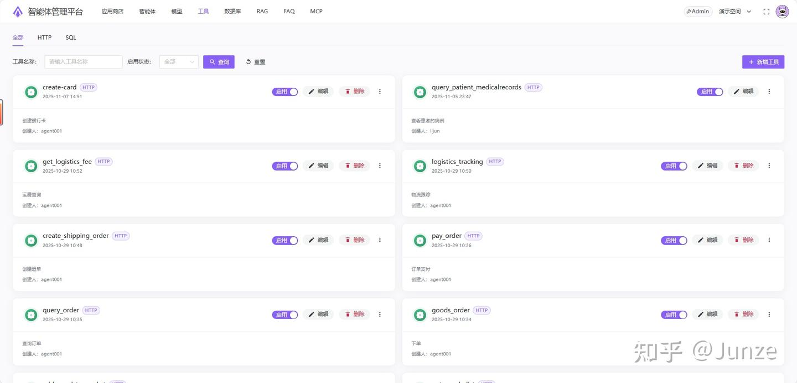
插件列表
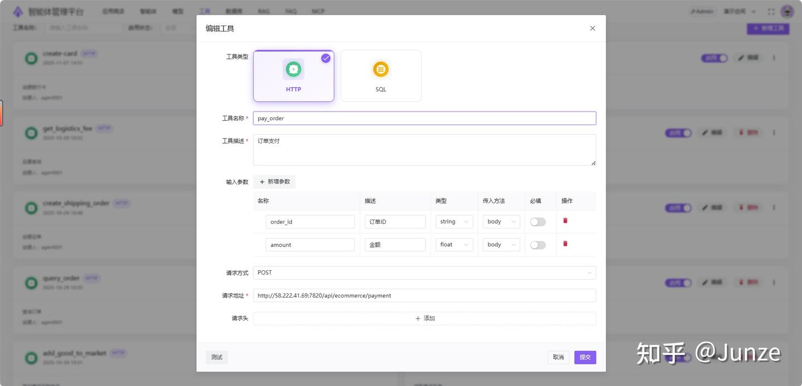
创建插件
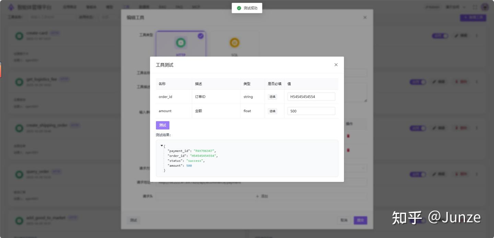
插件测试可用性
## 4.RAG知识库配置
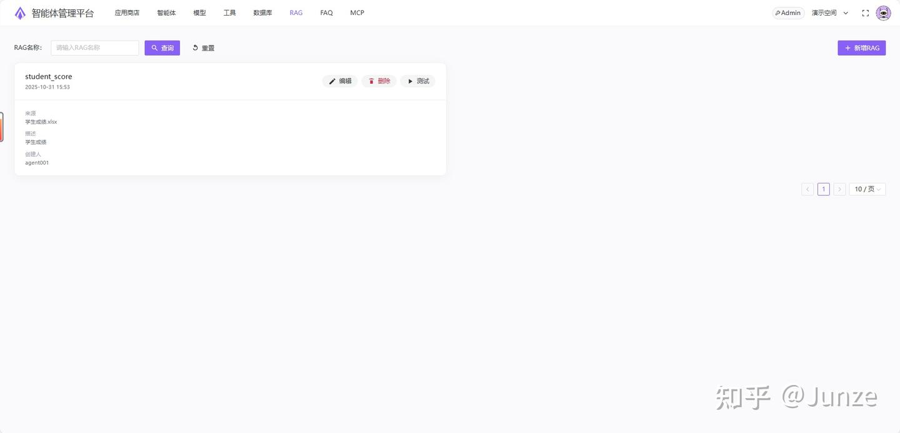
知识库列表
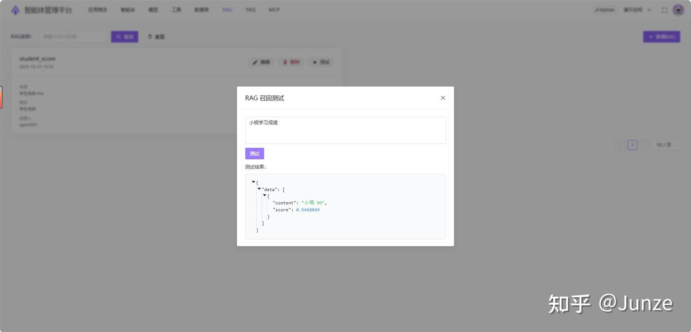
召回测试
## 5.FAQ问答对配置
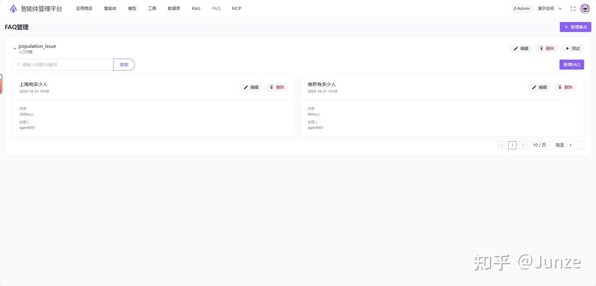
FAQ列表
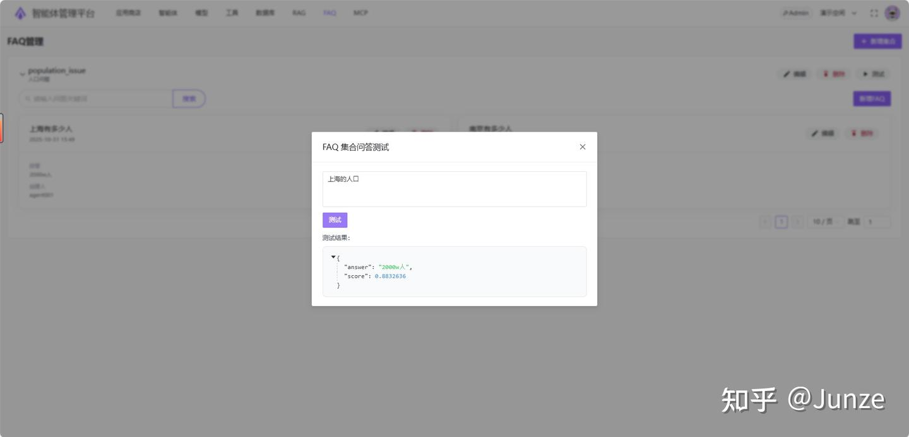
FAQ测试
## 6.数据库配置
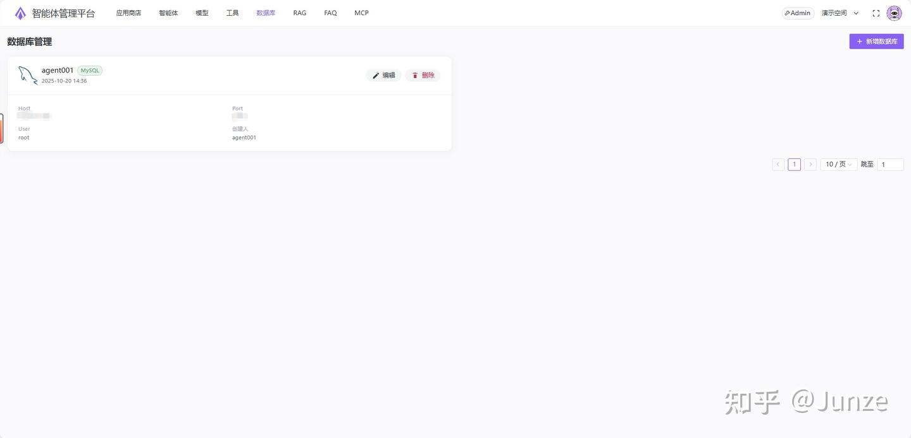
数据库接入
## 7.MCP配置
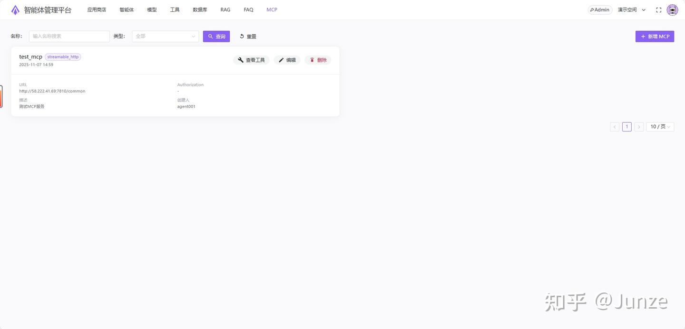
MCP服务
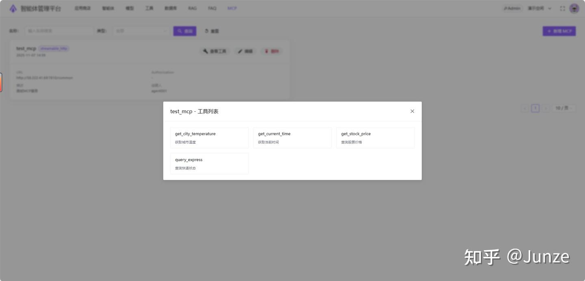
获取MCP服务下的工具
## 8.应用商店配置
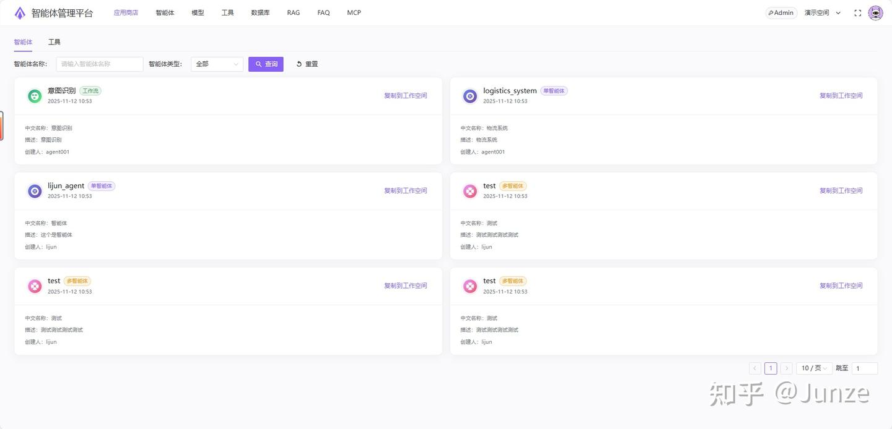
应用商店
## 9.团队协作
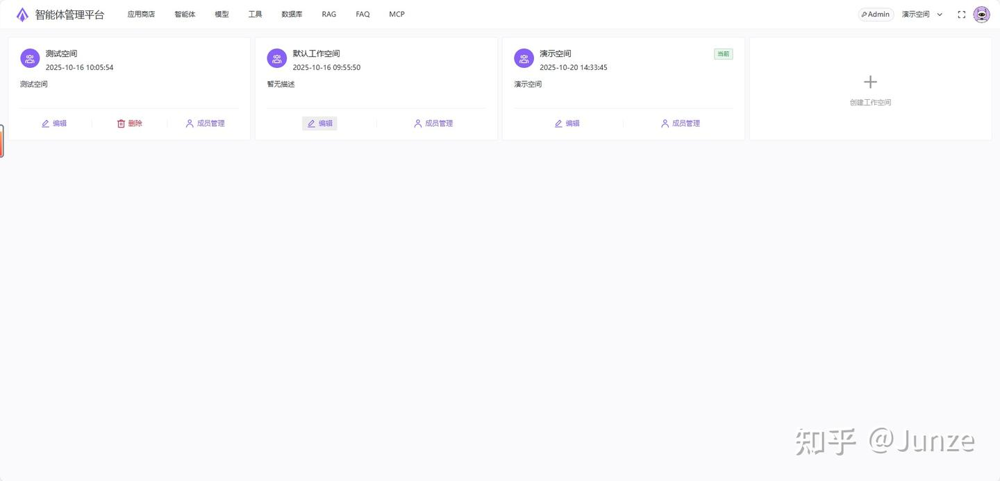
空间-用户管理